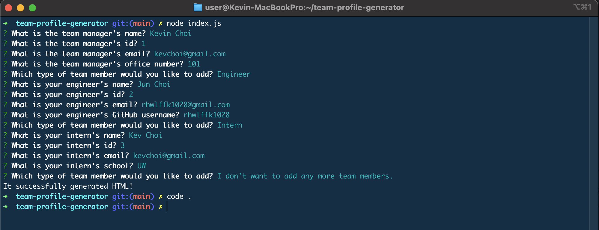
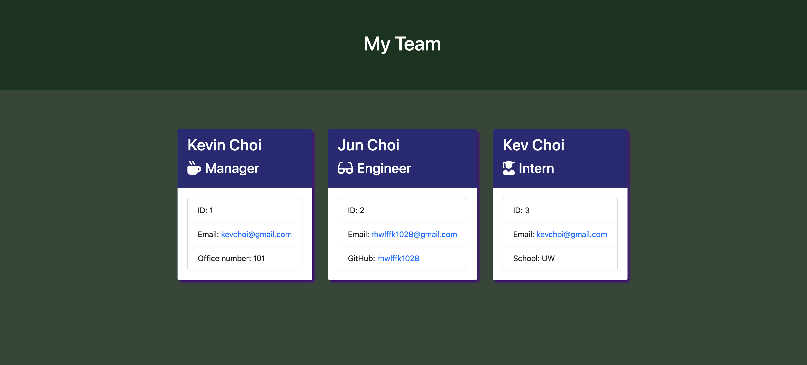

# HW10: team-profile-generator

  [](https://opensource.org/licenses/MIT)

  ## Description
  This project allows generating the HTML that displays the team member information. Node.js command-line application takes an information of manager, engineers, and interns. The Manager's card includes the name, the email, and the office number. The Engineer's card includes the name, the email, and the github username. The Intern's card includes the name, the email, and the school name. When you want to stop adding employees, then stop adding and the HTML with employees' information will be generated.

  ## Table of Contents
  * [Installation](#installation)
  * [Usage](#usage)
  * [License](#license)
  * [Contributing](#contributing)
  * [Tests](#tests)
  * [Questions](#questions)
 
  ## Installation
  Fork this repo into your GitHub. Make sure the fork process has been completed without any issue by checking all files in your forked repo. Verify wheter you have node.js installed on your desktop or not by running the comman node -v in your terminal. If you do not have node.js installed, please go to https://coding-boot-camp.github.io/full-stack/nodejs/how-to-install-nodejs and it will walk you through the process.

  ## Usage
  Once you completed the installation process, now it's time for you to generate your team profile and display in HTML. Once you try to run node index.js, it will probably give you an error BECAUSE the required dependencies are not installed yet into the root directory. Run npm install to install required dependancies. Then, you should be able to run node index.js. You will be prompted with questions and provide employees information. Feel free to add as many as you want or stop adding when you are done. Screenshot of prompt is shown below:

  
  

  [Demonstration Video Link](https://www.youtube.com/watch?v=6qvDDyxIYbw&ab_channel=KevinChoi)
  
  ## License
  This project is covered under MIT License.

  <details>
    <summary>
      See License
    </summary> 
  
  ```
  Copyright <2021> <Kevin Choi>

  Permission is hereby granted, free of charge, to any person obtaining a copy of this software and associated documentation files (the "Software"), to deal in the Software without restriction, including without limitation the rights to use, copy, modify, merge, publish, distribute, sublicense, and/or sell copies of the Software, and to permit persons to whom the Software is furnished to do so, subject to the following conditions:
  The above copyright notice and this permission notice shall be included in all copies or substantial portions of the Software.
  
  THE SOFTWARE IS PROVIDED "AS IS", WITHOUT WARRANTY OF ANY KIND, EXPRESS OR IMPLIED, INCLUDING BUT NOT LIMITED TO THE WARRANTIES OF MERCHANTABILITY, FITNESS FOR A PARTICULAR PURPOSE AND NONINFRINGEMENT. IN NO EVENT SHALL THE AUTHORS OR COPYRIGHT HOLDERS BE LIABLE FOR ANY CLAIM, DAMAGES OR OTHER LIABILITY, WHETHER IN AN ACTION OF CONTRACT, TORT OR OTHERWISE, ARISING FROM, OUT OF OR IN CONNECTION WITH THE SOFTWARE OR THE USE OR OTHER DEALINGS IN THE SOFTWARE.
  ```
  </details>
  

  ## Contributing
  No contribution will be accepted at this moment.

  ## Tests
  Run npm test in order to check your .js files.

  ## Questions
  If you have any questions, please contact me via

  * Email: [kevchoi1028@gmail.com](mailto:kevchoi1028@gmail.com)

  * GitHub: [https://github.com/rhwlffk1028](https://github.com/rhwlffk1028)

  * Linkedin: [https://linkedin.com/in/kevchoi](https://linkedin.com/in/kevchoi)